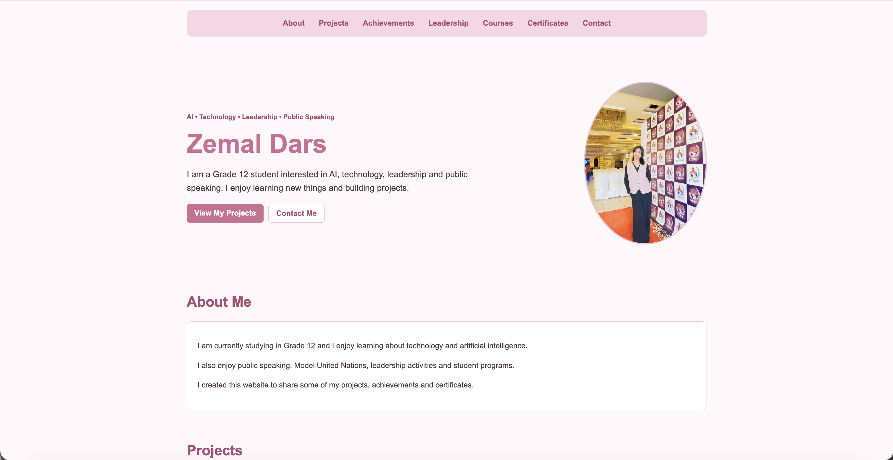

# Zemal Dars - Personal Website

A personal portfolio website where I share my projects, achievements, certificates, and interests.



## Live Website

You can view the website here:

https://zemaldars01-png.github.io/zemal-personal-site/

## About This Project

I created this website as a personal portfolio where I can keep my work, achievements, certificates, and activities in one place.

I am a Grade 12 student interested in technology, artificial intelligence, leadership, and public speaking.

While making this website, I got more practice with HTML, CSS, JavaScript, Git, GitHub, and GitHub Pages.

## Quick Start

The easiest way to use the project is to open the live website:

https://zemaldars01-png.github.io/zemal-personal-site/

No installation is needed if you only want to view the website.

## Features

- Simple navigation bar
- About Me section
- Projects with links to my work
- Achievements section
- Certificate gallery
- Contact links
- Responsive layout
- Back to top button
- Smooth scrolling

## Projects

### Personal Portfolio Website

This website itself is one of my projects and was built using HTML, CSS, and JavaScript.

Live site:

https://zemaldars01-png.github.io/zemal-personal-site/

### Out of Sync

A puzzle-style game I made using Godot where the player explores rooms, collects keys, and tries to escape.

Play it here:

https://zemal-dars.itch.io/out-of-sync

### ZemalBot

A Slack bot I built using JavaScript and Slack Bolt.

It includes custom commands and some API-based features.

View it here:

https://github.com/zemaldars01-png/zemal-slack-bot

## Built With

- HTML
- CSS
- JavaScript
- Git
- GitHub
- GitHub Pages

## How to Run It Locally

Clone the repository:

```bash
git clone https://github.com/zemaldars01-png/zemal-personal-site.git

Open the project folder:
cd zemal-personal-site

Then open index.html in your browser.
You can also run a simple local server:
python3 -m http.server 8000

Then open:
http://localhost:8000

No extra packages are required.
How It Works
HTML is used for the structure and content of the website.
CSS is used for the colors, layout, cards, buttons, images, and responsive design.
I used Flexbox for parts of the layout and CSS Grid for the cards and certificate gallery.
JavaScript is only used for the back-to-top button.
What I Learned
While making this project, I learned more about:
- organizing a webpage with HTML
- styling with CSS
- using Flexbox and Grid
- making a website responsive
- adding simple JavaScript
- using Git and GitHub
- publishing a website with GitHub Pages
I also learned that keeping code simple makes it easier to understand and update later.
Changes After Feedback
After receiving feedback, I simplified the CSS and removed unnecessary styling so the code is easier for me to understand and maintain.
I also improved this README so the project is easier to understand and run.
AI Usage
I used AI for guidance, explanations, and debugging when I got stuck.
After receiving feedback, I reviewed the project again and simplified the code so I could understand the styling and layout better.
Credits
Built by Zemal Dars.
Made as part of the Hack Club Stardance Challenge.