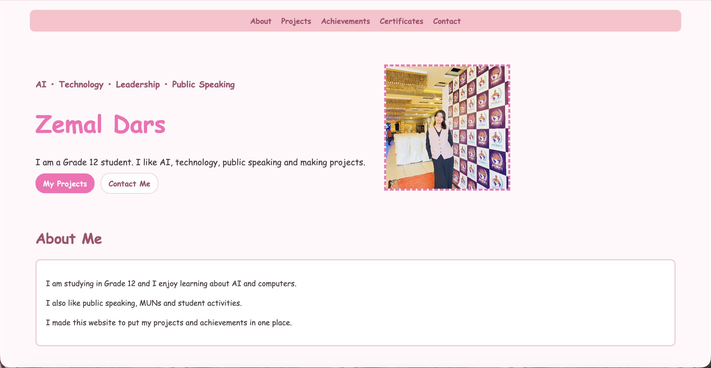

# My Website

Hi! I am Zemal and this is my personal website :)
You can see it here:  
https://zemaldars01-png.github.io/zemal-personal-site/
I made this website using HTML, CSS and a little bit of JavaScript.
I am still learning web development, so I watched YouTube videos and kept trying things until they worked.

## What I put on my website
- A little bit about me
- My projects
- Some of my achievements
- My certificates
- My contact links

## How I made it
First I thought about what I wanted to put on the website.
Then I started making each part one by one.
I chose pink because it is my favourite colour and I wanted the website to look simple and cute.

## Credits
I used YouTube videos to help me understand some parts:
- https://www.youtube.com/watch?v=vlDAQXqOqKo
- https://www.youtube.com/watch?v=-u3vE84Wo_U
- https://www.youtube.com/watch?v=z_qmpklj89sa
Thanks for checking out my website!